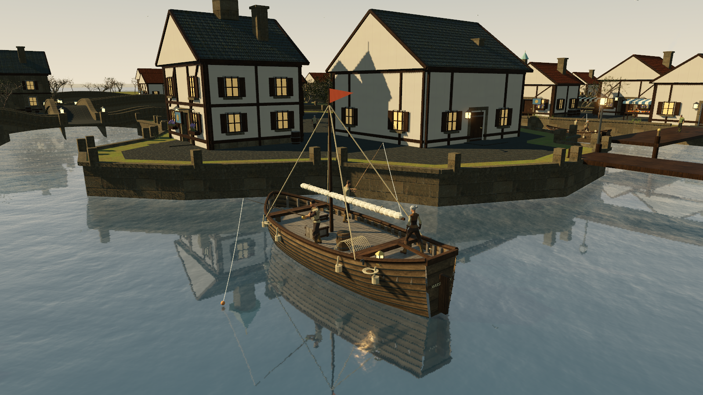
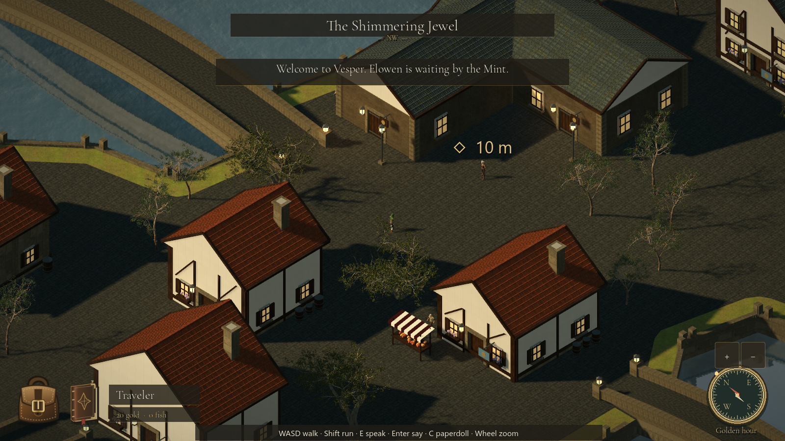

# Vesper — City of Bridges

**An unofficial Ultima Online fan tech demo, made for nostalgia and fun.**

I wanted to walk through Vesper again: the bridges, the bank, the little shops, and boats out on the water. This is the result—a small, playable interpretation of a city I remember fondly, built with Godot, Blender, and OpenAI Codex assistance.

**This will never become a complete game.** It is not an upcoming MMO, an official remake, a private server, or the beginning of a commercial game project. There is no full-game roadmap. It is a personal nostalgia experiment that I am sharing so other UO fans can wander around and enjoy it too.

— **Carl Prewitt Jr. / [rages4calm](https://github.com/rages4calm)**

## Download and play

### [Download the Windows demo](https://github.com/rages4calm/vesper-fan-tech-demo/releases/latest)

1. Download **`Vesper-Fan-Tech-Demo-v0.3.2-Windows-x64.zip`** from the release assets.
2. Extract the entire ZIP to a normal folder.
3. Open **`Vesper.exe`**. Keep **`Vesper.pck`** beside it.
4. Choose **Enter Vesper**, then explore. Elowen, outside the Mint, can start a short delivery quest.

No Godot or Blender installation, account, server, or internet connection is needed to play. The ZIP is portable; there is no installer. GitHub's automatically generated “Source code” ZIP is **not** the playable download.

**Platform:** Windows x64. The Forward+ renderer needs a Vulkan-capable GPU and current graphics drivers. This build was tested on Windows with an NVIDIA RTX 5070; minimum hardware requirements have not been established. Performance will vary. The executable is unsigned, so Windows may display an unknown-publisher warning. Checksums are included with the release.

## A small piece of Vesper

- Explore 33 buildings, canals, islands, and 22 bridge sections with a classic elevated camera, zoom, and rotation.
- Visit the L-shaped Mint, inn, tavern, museum, shipwright, and fishing shop. Nine doors open on approach, and roofs lift away inside accessible buildings.
- Walk through the waterfront shops to their docks, watch fishing crews work, and see a merchant vessel pass through the bay.
- Try a short delivery quest, fishing, bread purchases, and fish sales.
- Open a paperdoll and backpack, or say **bank**, **vendor buy**, and **vendor sell** near the appropriate NPCs.
- Switch between daylight, golden hour, and lantern night. Progress saves locally.

The geography is traced and simplified from historical references. This is an interpretation, not a tile-perfect reconstruction. Dialogue, residents, the quest, boat names, and the small economy were created for this demo.

**Not implemented:** combat, multiplayer, player-controlled sailing, a full crafting economy, the rest of Britannia, or interiors for every building. Please do not download expecting the complete Ultima Online experience or a promise that these systems will be added.

*The regular exploration interface, zoomed out near the Mint. Both screenshots are actual engine captures.*

## Controls

| Input | Action |
| --- | --- |
| WASD / arrow keys | Move |
| Shift / Space | Run / jump |
| Left-click a street | Walk to a destination |
| Hold right mouse + drag | Rotate the camera |
| Mouse wheel / compass + and − | Zoom |
| V | Switch camera view |
| E | Talk, interact, fish, or use a harbor lookout |
| M / J | Map / journal |
| C | Paperdoll; double-click its backpack to open inventory |
| I | Backpack |
| Enter | Type speech; Enter again to say it |
| T / H | Change lighting / hide interface |
| F11 / F12 | Fullscreen / photograph |
| Esc | Pause or close a panel |

Press **M** and select a blue dock marker to walk to a harbor lookout. At the brass-capped post, press **E** to watch the water; scroll to zoom. Press **E**, **Esc**, or a movement key to leave the lookout.

Near the Mint, inside or outside, say **bank** to store gold, fish, and bread. Say **vendor buy** near Lysa at The Twisted Oven, or **vendor sell** near Garrick in The Marsh Hall. This is local interaction, not online chat.

## Audio and local files

The public download includes original synthesized ambience and effects. **Original Ultima Online music and extracted UO sound effects are not bundled.** Some development videos use the original Vesper theme, so the public package's audio differs from those recordings.

To use a soundtrack you are entitled to use, pause the demo and select **Choose local music**, then select a local **OGG or WAV** file under 100 MB. It is copied into the demo's local data folder and loops during play. No audio is downloaded or uploaded by the demo.

**Looking for the familiar Vesper theme?** [Rabbit's Lair's Ultima Online music archive](http://ultima.rabbitslair.de/ultima_online.htm) lists **11 — Vesper** as an OGG download—the recording used in our development videos. Visit the archive, save that track locally under its personal-use terms, then choose it through **Esc → Choose local music**. The archive is independent of this project; the music retains its original rights.

Saves, settings, imported music, and photographs are stored in `%APPDATA%\Vesper Fan Tech Demo\`. Starting a new journey asks before replacing the current save. Automated checks use separate QA save and music files.

## Credits

This project exists because of the original Ultima Online creators and the artists and toolmakers who share their work:

| Contribution | Credit |
| --- | --- |
| Original game, Vesper, and Britannia | **Origin Systems and the original Ultima Online team**; related intellectual property remains with its respective rights holders |
| Project idea, direction, references, and playtesting | **Carl Prewitt Jr. / rages4calm** |
| AI-assisted programming, procedural modeling, and iteration | **OpenAI Codex**, directed and tested by Carl |
| Character bodies, outfits, and base animations | **Quaternius**, free Standard packs, CC0 |
| Trees, photographed materials, and furnishing models | **Poly Haven** and its contributing artists, CC0 |
| Engine | **Godot Engine contributors** |
| Modeling and asset preparation | **Blender Foundation and Blender contributors** |
| Display font | **Cormorant Garamond**, SIL Open Font License |
| Journal background | **OpenAI image generation**, created for this project |
| Historical reference material | **The Second Age manual**, **Stratics**, **UOGuide**, **Codex of Ultima Wisdom**, **YMT Vesper Diary**, and **Blade Spirit's Vesper video** |

See **[CREDITS.md](CREDITS.md)** for individual asset links, adaptations, music provenance, and bundled license notices. The demo was not created entirely from scratch, and AI assistance is acknowledged openly.

**This project is not endorsed by or affiliated with EA or its licensors.** It is also unaffiliated with Origin Systems, Broadsword, or the official Ultima Online service. Names and trademarks are used to identify the inspiration; no ownership of them is claimed. A fan disclaimer does not grant rights to the original game's content.

## Source and scope

The repository contains the Godot scripts, shaders, scene, release tools, and documentation. Large models and textures are supplied separately as **`Vesper-v0.3.2-Source-Assets.zip`** on the same release, avoiding Git LFS requirements for visitors. See **[Building the demo](docs/BUILDING.md)**.

The Windows package is free to download and play. This is a hobby artifact shared as-is, with no support schedule, multiplayer service, or commitment to further development. Bug reports are welcome, but feature requests are not a full-game development roadmap. See **[licensing and reuse](LICENSE.md)** and **[validation notes](docs/VALIDATION.md)**.
